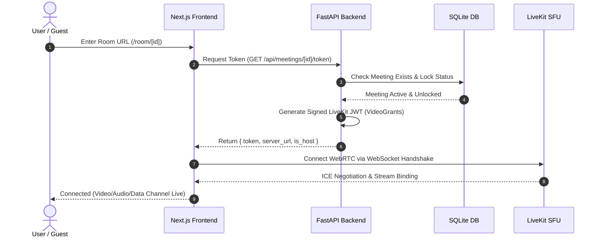

# System Architecture & Technical Design

This document details the architectural design, communication protocols, and data flow of **Minizoom**.

---

## 1. High-Level System Architecture

```
                                 [ Users / Browsers ]
                                          │
                        (HTTPS / WSS Port 443 - Public Internet)
                                          │
                                          ▼
                                ┌───────────────────┐
                                │   Reverse Proxy   │
                                │   (Nginx / Caddy) │
                                └─────────┬─────────┘
                                          │
                     ┌────────────────────┴────────────────────┐
                     │                                         │
        (HTTP / Internal Port 3000)               (HTTP / Internal Port 8000)
                     ▼                                         ▼
           ┌──────────────────┐                      ┌──────────────────┐
           │ Next.js Frontend │                      │ FastAPI Backend  │
           │  (App Router)    │                      │  (ASGI / uvloop) │
           └─────────┬────────┘                      └─────────┬────────┘
                     │                                         │
                     │ (MediaStream WebRTC & Data Channel)     │ (JWT Token Generation & API)
                     ▼                                         ▼
           ┌──────────────────┐                      ┌──────────────────┐
           │   LiveKit SFU    │                      │   Database       │
           │  (Cloud / Host)  │                      │ (SQLite WAL Mode)│
           └──────────────────┘                      └──────────────────┘
```

---

## 2. Component Breakdown

### A. Frontend Layer (`Next.js 14 + React + LiveKit Components`)
- **Render Engine**: Next.js Standalone Runner compiled into a lightweight Alpine Docker image (~100MB).
- **Media Presentation**: `@livekit/components-react` leveraging WebRTC `MediaStreamTrack` abstractions.
- **Interactivity Engine**: LiveKit Data Channel for peer-to-peer real-time broadcasting:
  - Floating Emoji Reactions (`reaction` packets).
  - Collaborative Whiteboard Strokes (`wb_draw` and `wb_clear` coordinate vectors).
  - Live Polls voting updates (`poll_new`, `poll_vote`).
  - Shared Notes debounced sync (`notes_sync`).
- **Audio Synthesizer**: Pure browser Web Audio API synthesizer for join/leave/chat chimes without external static assets.
- **Client-Side Recorder**: Web Audio API mixing (Mic Audio + Screen Audio) piped into `MediaRecorder` producing `.webm` downloads.

### B. Backend API Layer (`FastAPI + Python 3.11 + Uvicorn`)
- **Event Loop**: `uvloop` for asynchronous request processing.
- **Token Handshake Engine**: LiveKit Access Token signing with `api.VideoGrants` validating host permissions, identity uniqueness, and room lock status.
- **Server-Side Moderation**: LiveKit Server SDK invoking participant kick, track mute, and video disable operations directly on the SFU.
- **Background Tasks**: Asynchronous dispatch for SMTP email alerts and Discord Webhooks.

### C. Media & SFU Layer (`LiveKit WebRTC SFU`)
- **Topology**: Selective Forwarding Unit (SFU). Each publisher uploads a single uplink stream, and the SFU selectively forwards streams to subscribers without transcoding.
- **Audio Codec**: Opus (adaptive bitrate 24–32 kbps with Packet Loss Concealment & RED/FEC).
- **Video Codec**: VP8 / H.264 with Dynacast and Adaptive Simulcast layers.

### D. Data Persistence (`SQLite with WAL Mode`)
- **Concurrency Strategy**: SQLite configured with `PRAGMA journal_mode=WAL` (Write-Ahead Logging), `PRAGMA synchronous=NORMAL`, and `StaticPool` connection sharing.
- **Volume Mount**: Data mapped to Docker named volume `minizoom_data` at `/app/data/minizoom.db` ensuring zero data loss across rebuilds.

---

## 3. Communication & Data Flow Sequence

### Room Join Handshake:

