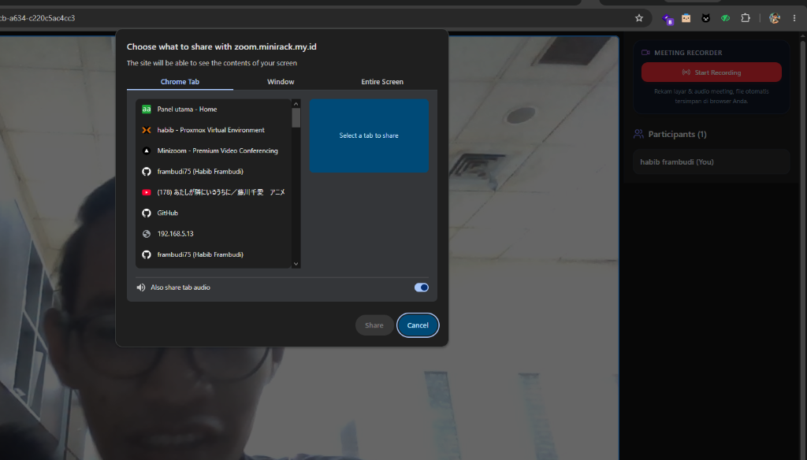
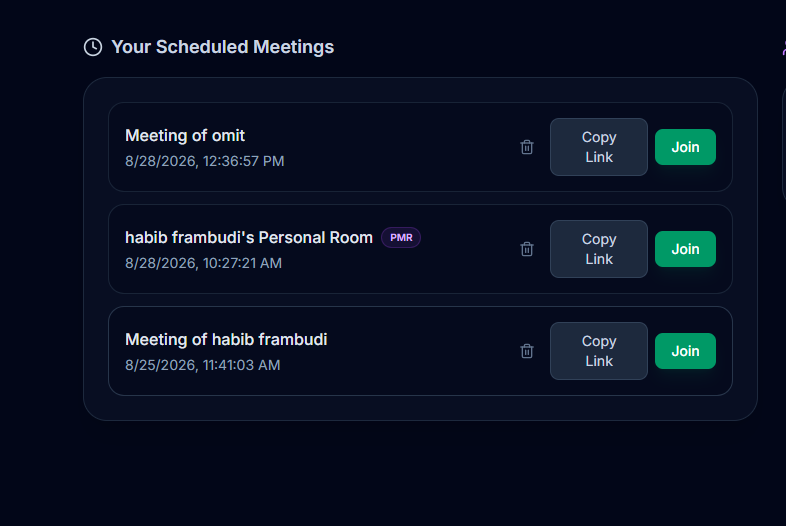
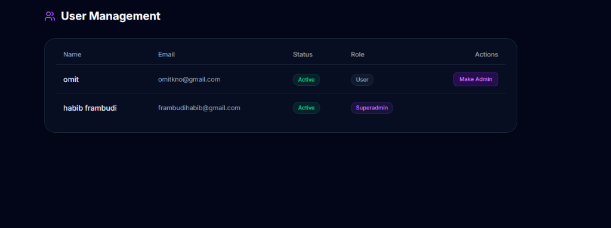
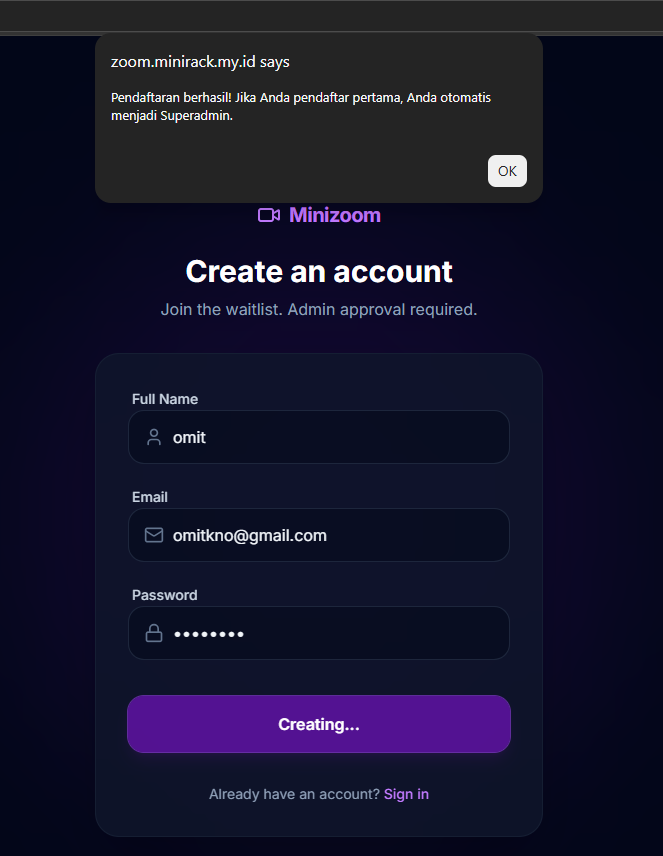

<div align="center">

# 📹 Minizoom

### **Self-Hosted, Ultra-Lightweight & Enterprise Video Conferencing**

*Production-ready video meetings with zero bloat, low-latency WebRTC SFU, interactive whiteboards, and centralized access control.*

<br/>

[](https://zoom.minirack.my.id/)
[](https://nextjs.org/)
[](https://fastapi.tiangolo.com/)
[](https://livekit.io/)
[](https://www.docker.com/)
[](#-progressive-web-app-pwa)
[](LICENSE)

<br/>

[✨ Features](#-key-features) • [📸 Screenshots](#-product-showcase) • [🏛️ Architecture](#-system-architecture) • [🚀 Quick Start](#-quick-start-docker) • [📚 Docs](#-documentation-suite)

</div>

---

## 📸 Product Showcase

<div align="center">

### 🖥️ 1. Meeting Room & Live Conference
*High-definition video grid, host moderation controls, real-time recorder, and live participant counter.*



<br/>

### 📊 2. Modern Dashboard & Scheduled Meetings
*Overview hub for instant room generation, recurring PMR links, and real-time meeting attendee counters.*



<br/>

### 🛡️ 3. Centralized User Management & Superadmin Approval
*Role-based access control with single-click user approvals, role promotions, and system health status.*



<br/>

### 🔐 4. Account Registration & Auth Pipeline
*Clean, glassmorphic authentication flow with automated superadmin bootstrap.*



</div>

---

## 🏛️ System Architecture

```
                                 [ Users / Browsers ]
                                          │
                        (HTTPS / WSS Port 443 - Public Internet)
                                          │
                                          ▼
                                ┌───────────────────┐
                                │   Reverse Proxy   │
                                │   (Nginx / Caddy) │
                                └─────────┬─────────┘
                                          │
                     ┌────────────────────┴────────────────────┐
                     │                                         │
        (HTTP / Internal Port 3000)               (HTTP / Internal Port 8000)
                     ▼                                         ▼
           ┌──────────────────┐                      ┌──────────────────┐
           │ Next.js Frontend │                      │ FastAPI Backend  │
           │  (App Router)    │                      │  (ASGI / uvloop) │
           └─────────┬────────┘                      └─────────┬────────┘
                     │                                         │
                     │ (MediaStream WebRTC & Data Channel)     │ (JWT Token Generation & API)
                     ▼                                         ▼
           ┌──────────────────┐                      ┌──────────────────┐
           │   LiveKit SFU    │                      │   Database       │
           │  (Cloud / Host)  │                      │ (SQLite WAL Mode)│
           └──────────────────┘                      └──────────────────┘
```

---

## ✨ Key Features

| Feature | Description |
| :--- | :--- |
| **⚡ LiveKit WebRTC SFU** | Ultra low-latency (<200ms) video & Opus audio streaming with adaptive simulcast. |
| **🎭 Pre-Join Lobby** | Live camera preview, device toggles, and real-time microphone decibel volume meter. |
| **🎨 Interactive Whiteboard** | Real-time collaborative canvas with pens, highlighters, erasers, and PNG export. |
| **📊 Live Polls & Voting** | Instant participant voting with animated percentage progress bars. |
| **📝 Shared Notes** | Real-time collaborative meeting minutes with 1-click `.txt` file export. |
| **🛡️ Host Moderation** | Complete host controls: **Mute All**, mute individual, disable camera, and kick participants. |
| **🔒 Room Locking** | Secure meetings on-the-fly; unauthorized guests are blocked at the API gateway. |
| **🎬 Meeting Recorder** | Client-side mixed audio & video screen capture downloaded directly as `.webm`. |
| **🔗 Personal Meeting Room (PMR)** | Static permanent link assigned per user for recurring ad-hoc meetings. |
| **📶 Low-Data Mode** | Dynamic resolution and bitrate throttle for constrained cellular network environments. |
| **🔔 Web Audio Chimes** | Built-in join/leave and chat sound effects powered by browser Web Audio synthesizer. |
| **📲 PWA Support** | Fully installable as a standalone app on Android, iOS Safari, and Desktop PC. |
| **👥 Centralized RBAC** | User approval workflow with automated SMTP email alerts and Discord webhooks. |

---

## 💾 Database & Production Concurrency

- **SQLite WAL Mode (Default)**: Preconfigured with `PRAGMA journal_mode=WAL` and `StaticPool` connection sharing.
  - *Why it's fast*: Database queries only execute during initial authentication and token signing. Active meeting media flows entirely in-memory through the WebRTC SFU with **zero database load during conferences**.
  - *Capacity*: Designed for small to medium-sized organizations, targeting **up to 50 concurrent participants** per room depending on server CPU, network NIC bandwidth, and SFU allocation.
- **Enterprise Multi-Node Scaling**: Switch seamlessly to **PostgreSQL** by updating the `DATABASE_URL` in `.env` without changing any application code.

---

## 🚀 Quick Start (Docker)

### 1. Clone Repository
```bash
git clone https://github.com/frambudi75/minizoom.git
cd minizoom
```

### 2. Configure Environment Variables
Copy `.env.example` to `.env`:
```bash
cp .env.example .env
```

Configure your credentials in `.env`:
```env
SECRET_KEY=your_random_secret_key_here
LIVEKIT_URL=wss://your-livekit-server.livekit.cloud
LIVEKIT_API_KEY=your_api_key
LIVEKIT_API_SECRET=your_api_secret
```

### 3. Build & Run
```bash
sudo docker compose up -d --build
```

Access Minizoom at `http://localhost:3000` (or your domain).

---

## 📚 Documentation Suite

- 🏛️ [System Architecture](docs/ARCHITECTURE.md) - Deep architectural breakdown, data flow, and token lifecycle.
- 🚀 [Production Deployment](docs/DEPLOYMENT.md) - Nginx reverse proxy configuration, SSL Certbot, and port forwarding.
- 🛡️ [Security Architecture](docs/SECURITY.md) - RBAC policies, JWT signing, and room privacy models.
- 🔧 [Troubleshooting Guide](docs/TROUBLESHOOTING.md) - Diagnostics for media permissions, network ICE, and Docker caches.

---

## 📄 License

This project is licensed under the MIT License - see the [LICENSE](LICENSE) file for details.
